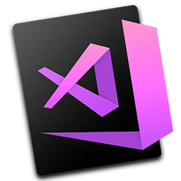

<p align="left">
  
</p>

# vscode-Set-Icon

Этот проект содержит скрипт для установки кастомной иконки для Visual Studio Code на macOS. Иконка, используемая в этом проекте, представлена на изображении выше.

## Установка и использование

Чтобы установить кастомную иконку для Visual Studio Code, выполните следующие шаги:

1. Клонируйте репозиторий на свою машину:
```bash
git clone https://github.com/vladgohn/vscode-Set-Icon.git
```

2. Перейдите в папку репозитория:
```bash
cd vscode-Set-Icon
```
3. Создайте и запустите скрипт `run.sh` с правами администратора:
```bash
echo '#!/bin/bash' > run.sh
echo 'chmod +x change_vscode_icon.sh' >> run.sh
echo './change_vscode_icon.sh' >> run.sh
chmod +x run.sh
sudo ./run.sh
```
После выполнения этих команд Visual Studio Code будет запущен с новой иконкой, указанной в файле `Code.icns`.

Создание проекта: [Ваше имя или псевдоним]. Автоматическая поддержка: GPT-4 от OpenAI. 

## Лицензия
Этот проект доступен по лицензии [MIT License](./LICENSE).
